# Media Grabber

## Table of Contents

1. [Program Description](#1-program-description)
2. [Application Overview](#2-application-overview)
3. [Hardware Requirements](#3-hardware-requirements)
4. [Installation and Configuration](#4-installation-and-configuration)
5. [Program Environment](#5-program-environment)
   - [Input Data](#51-input-data)
   - [User Communication](#52-user-communication)
   - [Program Outputs](#53-program-outputs)
   - [Examples of Input Data and Program Results](#54-examples-of-input-data-and-program-results)
6. [Program Structure](#6-program-structure)
   - [Description of External Files](#61-description-of-external-files)
   - [Module Division](#62-module-division)
7. [UML Diagrams](#7-uml-diagrams)
   - [Use Case Diagram](#71-use-case-diagram)
   - [Activity Diagram](#72-activity-diagram)

## 1. Program Description

The "Media Grabber" program is a mobile application that allows users to download and display multimedia content from social media platforms, with additional security provided through a fingerprint reader.

## 2. Application Overview

This application is designed for users who frequently download videos from social media, ensuring secure storage of multimedia content. Its primary purpose is to enable the downloading of videos from various social platforms and provide additional access security using a fingerprint reader. The application also has the ability to generate cookies to facilitate downloading from websites that require a user account.

## 3. Hardware Requirements

- A functioning Android phone
- Minimum Android version 10 (API 29)
- Internet access for downloading videos
- Access to files for saving and playback
- Camera access for recording videos and using the flashlight
- Use of Android BiometricPrompt for fingerprint support

## 4. Installation and Configuration

To install the application, download and run the APK file. After granting the necessary permissions, the application will install on your phone.

## 5. Program Environment

### 5.1 Input Data

The input data for the application includes a PIN code and website addresses. The user creates the PIN code during the first launch of the application, entering 4 to 8 digits and confirming it. The PIN code is then stored in SharedPreferences and becomes one of the login options in addition to biometric scanning. If the user provides a website link, it will be used to generate a cookie by opening the link in the WebView browser. If the user provides a video link, it will be used for downloading the video.

### 5.2 User Communication

The application shows the current download percentage and displays "Toast" messages upon download completion, cookie generation, and potential errors.

### 5.3 Program Outputs

The program provides users with various results related to downloading videos using youtubedl-android and generating cookies in WebView.

Additionally, extra features are easy to notice: when the flashlight function is activated, the phone automatically turns on the flashlight, informing the user of the operation's success. Similarly, launching the QR/barcode scanner will activate the camera with scanning functionality. A successfully scanned code will be saved to the clipboard.

In case of any errors related to any function, the user will receive appropriate error messages. For example, if the required permissions to read memory are missing, a text message will be displayed instead of a video list. If biometric authorization fails, an error message with the cause will appear.

### 5.4 Examples of Input Data and Program Results

#### Granting Permissions

Upon the first launch, the application will request all necessary permissions.

<!--  -->

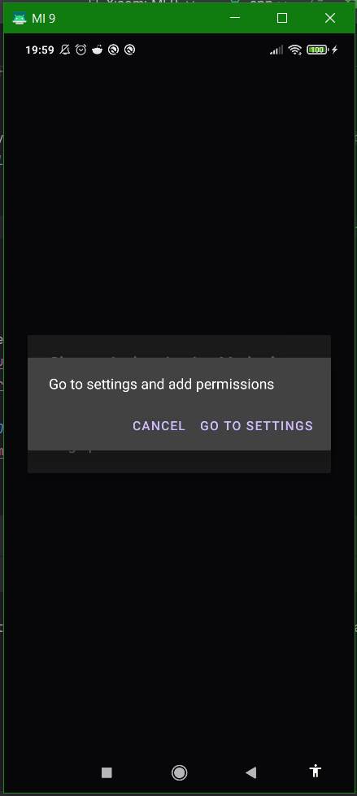

If permissions are denied, on the next launch, a window will appear that will take you directly to the settings to grant permissions.

#### Creating a PIN Code

Upon the first launch, a message will prompt you to create a new PIN code:
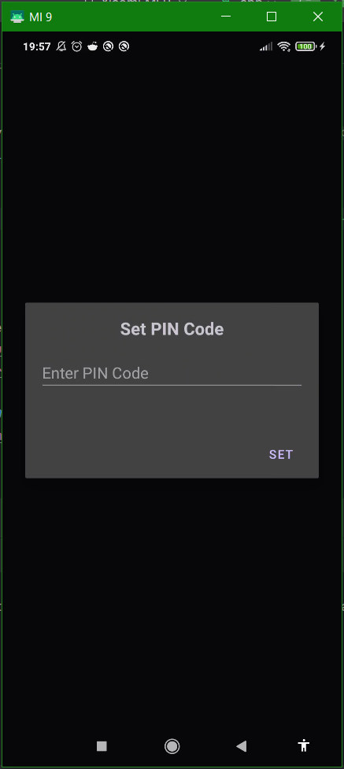
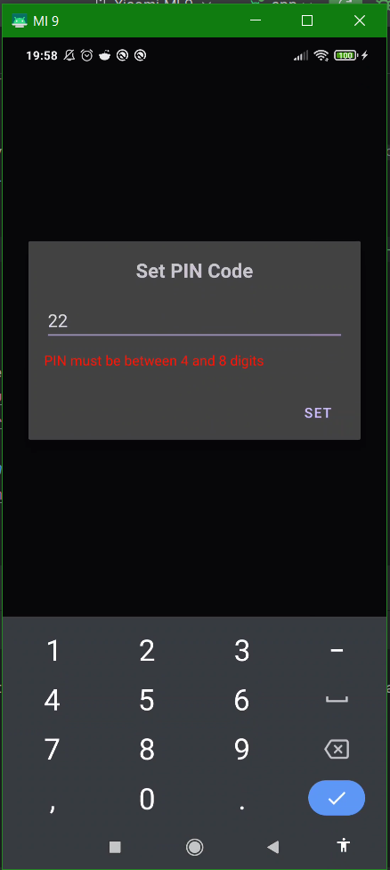

If the user enters a PIN that is too short or too long, a notification will appear. After successfully creating the PIN, the login options window will open automatically.

#### Logging In

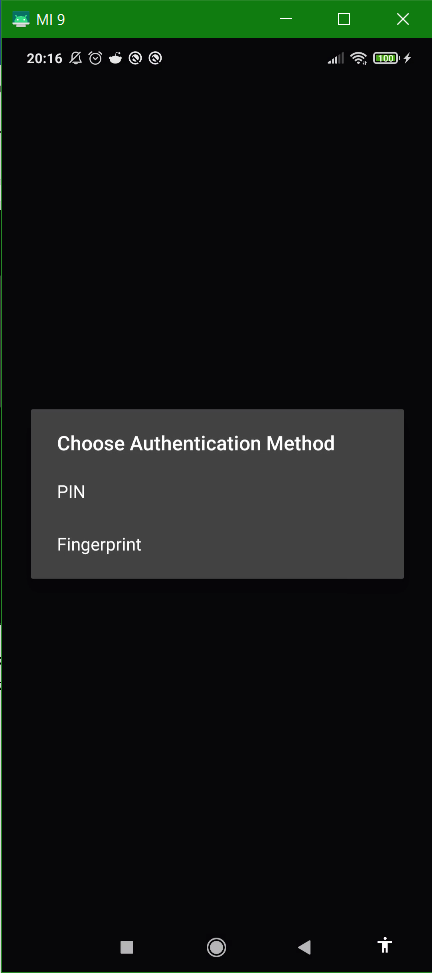
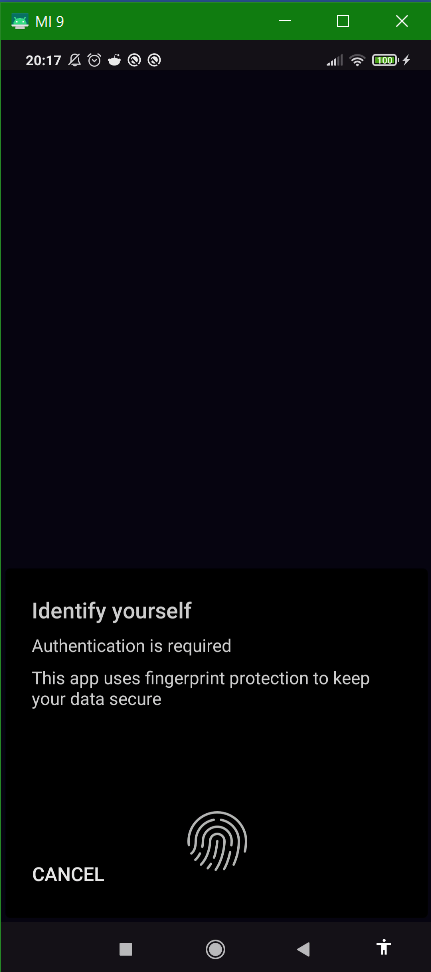

The user can choose to log in with either a PIN code or a fingerprint.

#### Displaying the Video List

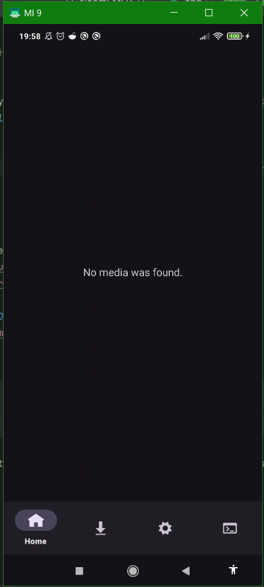
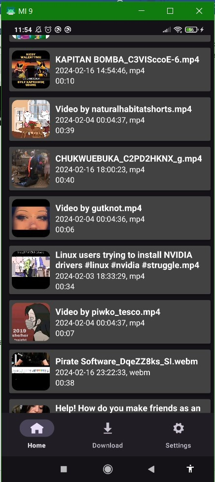

If there are no downloaded videos (or if permission to read memory is not granted), a text message will appear instead of a list.

#### Sharing Gestures

The gestures in the application are intuitive and easy to remember. Swipe gestures are used for sharing or deleting a video, with additional visual cues provided by colors and icons.
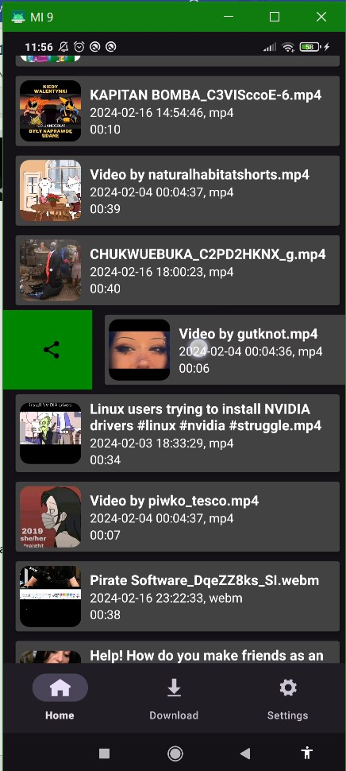
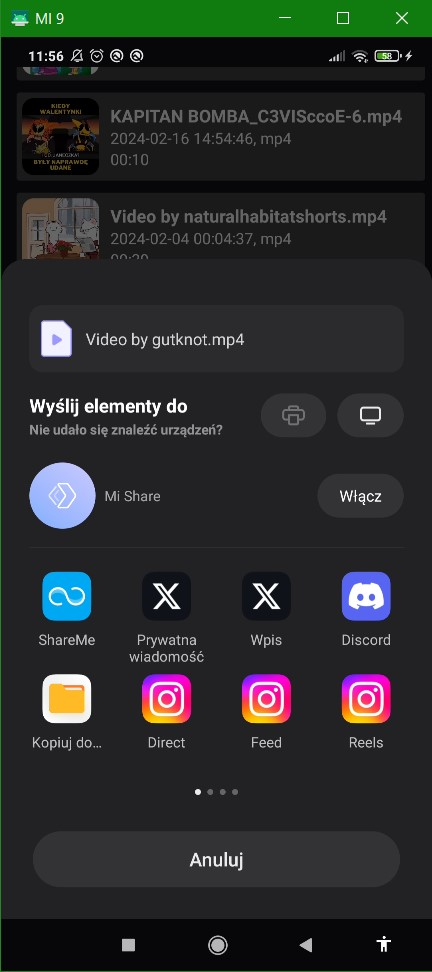

The sharing gesture is green with a standard "share" icon.

#### Deletion Gesture

The deletion gesture has a trash can icon and is red, indicating the possibility of permanently deleting the video.
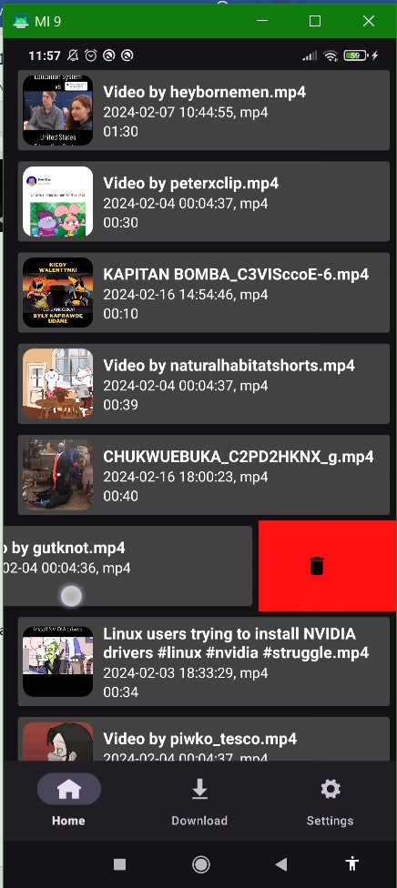

#### Video Playback

Videos are played using a tap gesture. The user selects a video from the list, and upon tapping, the video will open.
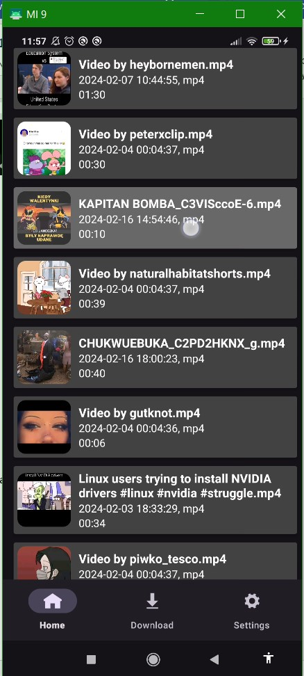
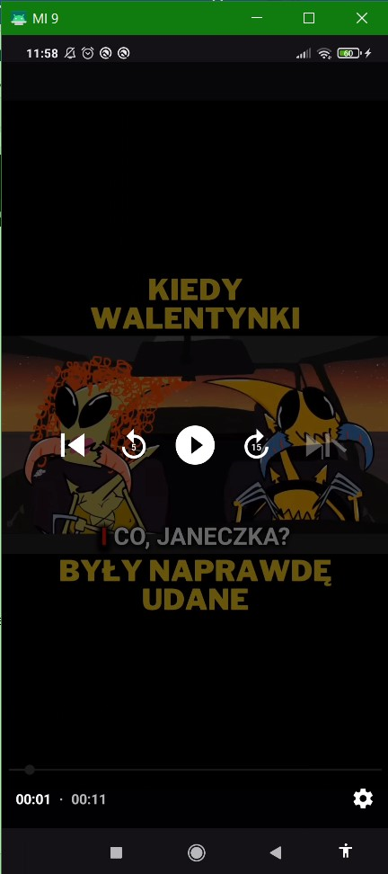

#### Downloading Videos

While downloading videos, a progress bar is visible to inform the user about the download status. A message will appear after a successful or unsuccessful attempt.
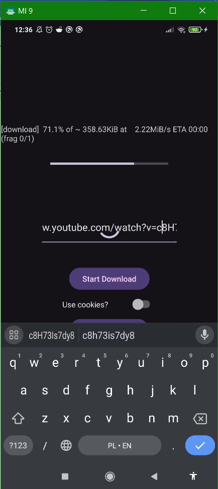
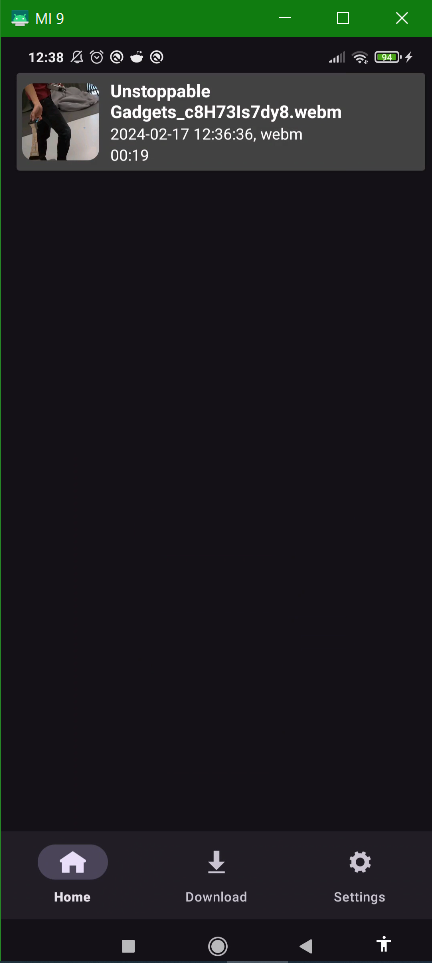

#### Settings

In the settings section, the user has six useful options to choose from:

- Flashlight
- Video recording
- Vibrations
- QR code scanning
- Application shutdown
- Cookie generation
  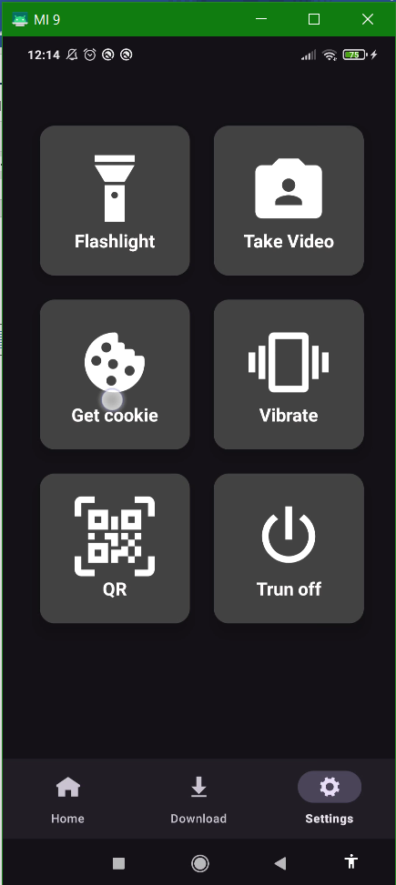
  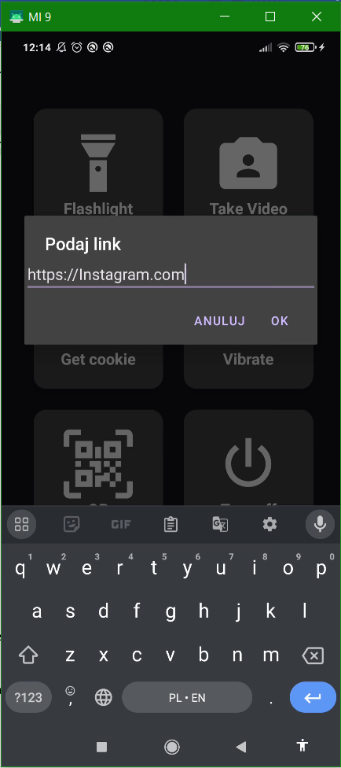

Clicking on the "Get cookie" tile will display a window requesting a URL. After clicking OK, the page will open in WebView.
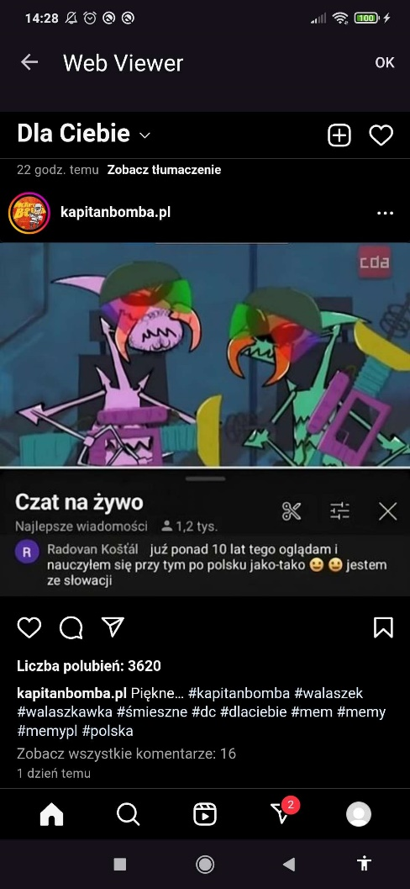
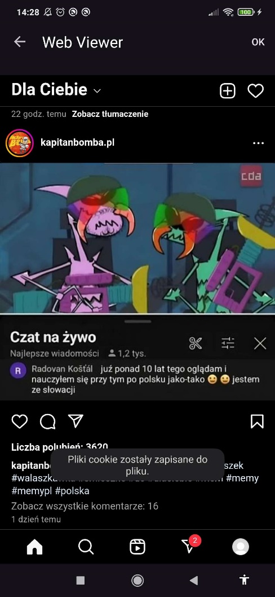

After logging into the service, an "OK" button will appear. Clicking it will generate the cookies.

## 6. Program Structure

### 6.1 Description of External Files

The application uses the youtubedl-android library, whose code is stored in the "Library" module. The application also uses links to websites, which are external sources used for downloading videos and generating cookies.

### 6.2 Module Division

The application is fairly simple. It is based on downloading videos from the Internet and managing them, displaying, deleting, etc. However, the biggest challenge was adapting the Android Binary Interface from the "Library" module to each processor architecture in the phone, ensuring the application works on every device.

## 7. UML Diagrams

### 7.1 Use Case Diagram

#### Actors Definition

**Actor:** User  
**Description:** The user can log in to the system using a biometric scanner or PIN code. If the PIN code does not exist, the user must create one. Additionally, the user can use the flashlight and QR/barcode scanner.

**Use Cases:**

- UC Login/Create PIN
- UC Download Video
- UC Display Video List

#### UC Login/Create PIN

**Description**  
**Goal:** Log in to the system  
**WS:** Can be called from UC Login/Create PIN  
**WK:** Provide necessary data for logging in: PIN code or biometric scan

**Flow:**  
Logging into the system is called right at the start of the program. You need to enter a PIN code or use a biometric scan to continue. The user either places a finger on the scanner and proceeds or enters the PIN code. If the data is incorrect, another attempt to log in is made. If the biometric scan fails, only a few attempts can be made at once. If the PIN has not yet been set, the process of creating a PIN code begins, where the user enters a new PIN code consisting of 4-8 digits. This process will continue until a correct new code is entered, which will then be saved to SharedPreferences.

### 7.2 Activity Diagram

#### Activity Diagram for UC Download Video

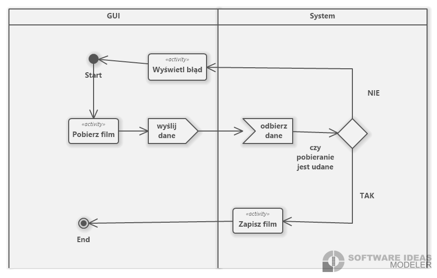
